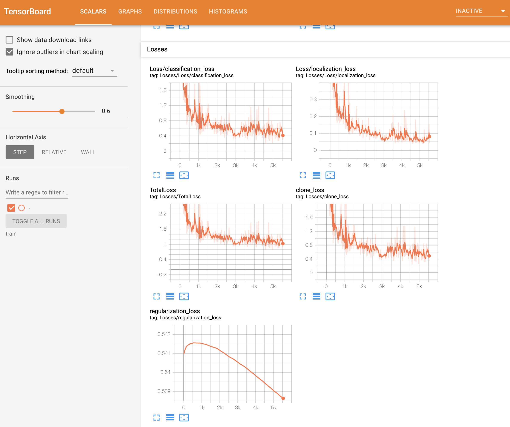
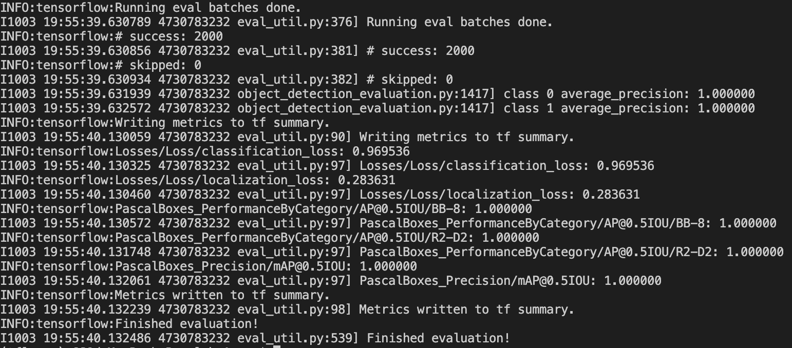
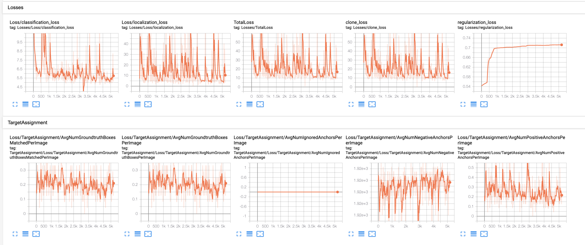

# Transfer Learning:
## Tutorial:

- # lab1: [blog](https://averdones.github.io/tensorflow-object-detection-star-wars) and [github](https://github.com/averdones/star_wars_object_detection)

  > re-train the weights of the ConvNet using regular backpropagation. Since the initial layers of a CNN tend to explain more primitive shapes, common to many different objects, we could choose to re-train only the higher layers and fix the lower ones (the ones closer to the input)

  1. ### Annotate images [labelImg](https://github.com/heartexlabs/labelImg)
  
  2. ### Preprocess the data(into TFRecords) and download the model: [model in tensorflow](https://github.com/tensorflow/models/blob/master/research/object_detection/g3doc/tf1_detection_zoo.md)
      - https://github.com/tensorflow/models/blob/master/research/object_detection/g3doc/using_your_own_dataset.md
     - https://github.com/tensorflow/models/blob/master/research/object_detection/g3doc/defining_your_own_model.md
     - 
  
  3.  ### Continuing, [Tensorflow API Installlation](https://github.com/tensorflow/models/blob/master/research/object_detection/g3doc/tf1.md)
      - ### [Reference github to complete the rest](https://github.com/git-hamza/Object_Detection)
      
      - ### [Reference Object Detection API utility](https://www.guyuehome.com/29950)
      
      - Place the model-master as the sub-directory at [6]-Transfer-Learning-eg/
      
      - [Install API Reference](https://tensorflow-object-detection-api-tutorial.readthedocs.io/en/2.2.0/install.html#install-the-object-detection-api)
      
      - `export PYTHONPATH=$PYTHONPATH:/path/to/models`
      
      - Confirm that API has been installed.
      
        
      
      - **[Python <-> Tensorflow](https://tensorflow.google.cn/install/source_windows#cpu)  
      
      - 
      
  4. ### Train and export model and Visualize [tesorflow object_detection_tutorial.ipynb](https://github.com/tensorflow/models/blob/master/research/object_detection/colab_tutorials/object_detection_tutorial.ipynb) 
  
      After retraining, `tensorboard` with train_dir:
  
       
      
  5. #### Before Visualization, `saved_model_cli show --dir ./output_inference_graph.pb/saved_model/ --all` to see the Variables.
  
  6. (PS: **models** dir Parallel to lab-1)
  
  7. Evaluation: ([AP@0.5IOU =1](https://www.researchgate.net/figure/Average-precision-during-training-Note-AP05IOU-refers-to-the-average-precision-at-IoU_fig2_358518927))
  
                 

---

- # lab2: (based on KITTI)
  - ### [Datadet](https://blog.csdn.net/weixin_44003563/article/details/105384659?spm=1001.2101.3001.6650.1&utm_medium=distribute.pc_relevant.none-task-blog-2%7Edefault%7ECTRLIST%7ERate-1-105384659-blog-103913361.pc_relevant_3mothn_strategy_recovery&depth_1-utm_source=distribute.pc_relevant.none-task-blog-2%7Edefault%7ECTRLIST%7ERate-1-105384659-blog-103913361.pc_relevant_3mothn_strategy_recovery&utm_relevant_index=2)
  
  - ### [VOC](https://arleyzhang.github.io/articles/1dc20586/)
  
  - ### Preprocess the data
  
  - ## Also, there should be another way to [turn KITTI into TFRecord](https://github.com/tensorflow/models/blob/master/research/object_detection/dataset_tools/create_kitti_tf_record.py)
  
  - However, the result seems not so well. 5000 without convergency ([too many instances?](https://zhuanlan.zhihu.com/p/98666173) and [too high learning rates](https://blog.csdn.net/ytusdc/article/details/107738749))
  
    

       

  - ### Problems:
    1. https://github.com/tensorflow/models/issues/3922
    2. https://github.com/tensorflow/models/issues/3384
    3. https://github.com/tensorflow/models/issues/2203
    4. https://github.com/tensorflow/models/issues/7511

   

  - ### Solutions(HERE Paused, to do the next task):
    Now, I understand how to do the simple transfer learning, and its entire workflow.  
    When I decrease the learning rate and the number of the training instances(to avoid overfitting), the losses can be declined after a longer fine-tuning process(20000 epoches). However, [the mAP@0.5 is still zero](https://www.zhihu.com/question/490796220).
    
       
      
    1. Unfreeze more lower layers (few train data [need](https://www.zhihu.com/question/383807358) to [freeze](https://www.cnblogs.com/shanqiu24/p/15844457.html)) 
    2. Use KITTI to create TFRecord files directly.
