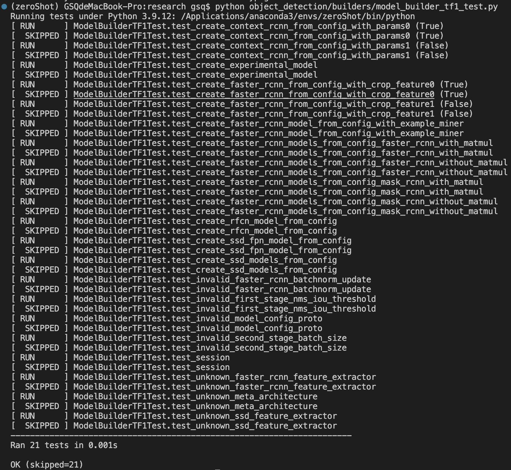

# Transfer Learning:
## Tutorial:

- ## lab1: [blog](https://averdones.github.io/tensorflow-object-detection-star-wars) and [github](https://github.com/averdones/star_wars_object_detection)

  > re-train the weights of the ConvNet using regular backpropagation. Since the initial layers of a CNN tend to explain more primitive shapes, common to many different objects, we could choose to re-train only the higher layers and fix the lower ones (the ones closer to the input)

  1. ### Annotate images [labelImg](https://github.com/heartexlabs/labelImg)
  
  2. ### Preprocess the data(into TFRecords) and download the model: [model in tensorflow](https://github.com/tensorflow/models/blob/master/research/object_detection/g3doc/tf1_detection_zoo.md)
      - https://github.com/tensorflow/models/blob/master/research/object_detection/g3doc/using_your_own_dataset.md
     - 
  
  3.  ### Continuing, [Tensorflow API Installlation](https://github.com/tensorflow/models/blob/master/research/object_detection/g3doc/tf1.md)
      - ### [Reference github to complete the rest](https://github.com/git-hamza/Object_Detection)
      - ### [Reference Object Detection API utility](https://www.guyuehome.com/29950)
      - Place the model-master as the sub-directory at [6]-Transfer-Learning-eg/
      - [Install API Reference](https://tensorflow-object-detection-api-tutorial.readthedocs.io/en/2.2.0/install.html#install-the-object-detection-api)
  
      - `export PYTHONPATH=$PYTHONPATH:/path/to/models`
  
      - Confirm that API has been installed.
  
        
  
      - **[Python <-> Tensorflow](https://tensorflow.google.cn/install/source_windows#cpu)  
      
  4. ### Train and export model and Visualize  
  
      After retraining, `tensorboard` with train_dir:
  
       
      
  5. #### Before Visualization, `saved_model_cli show --dir ./output_inference_graph.pb/saved_model/ --all` to see the Variables.
  
  5. (PS: **models** dir Parallel to lab-1)